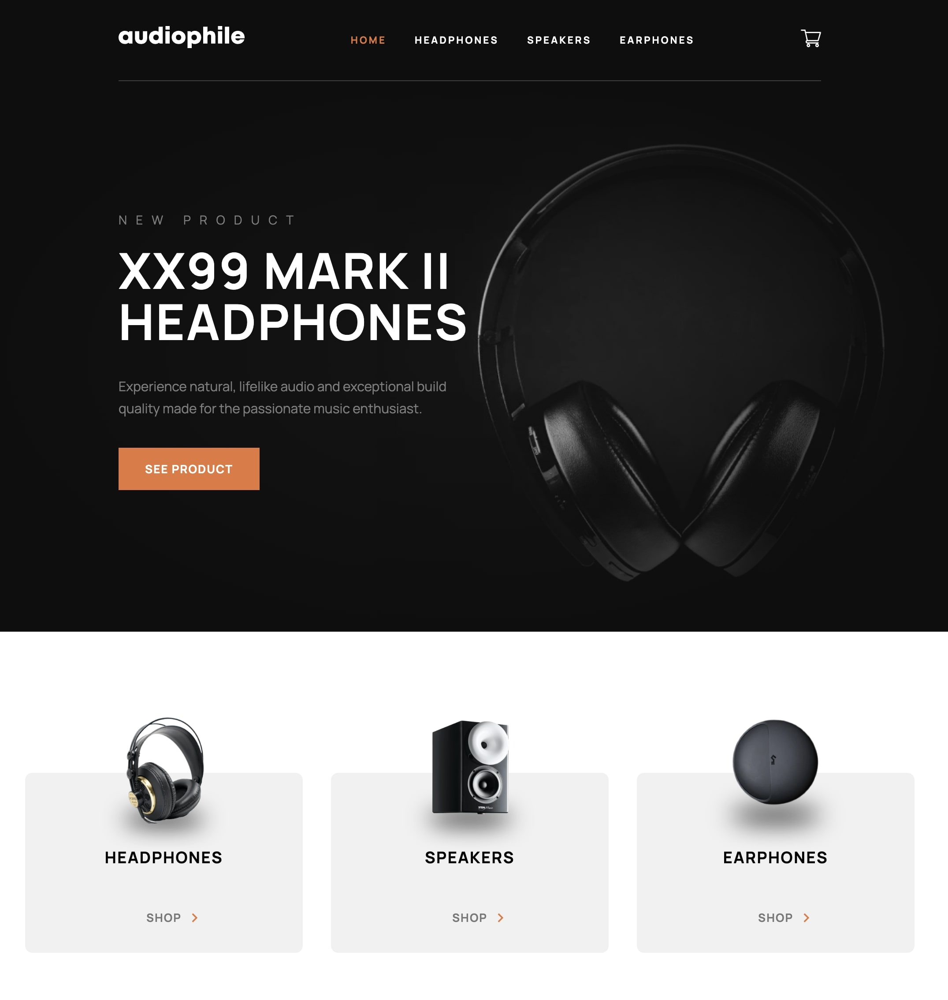
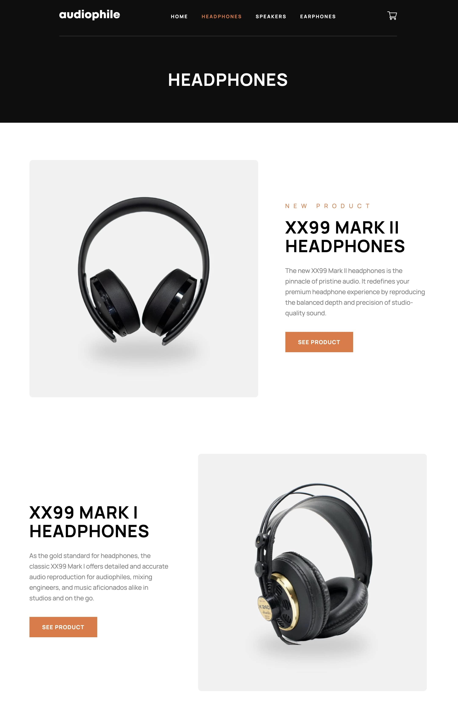
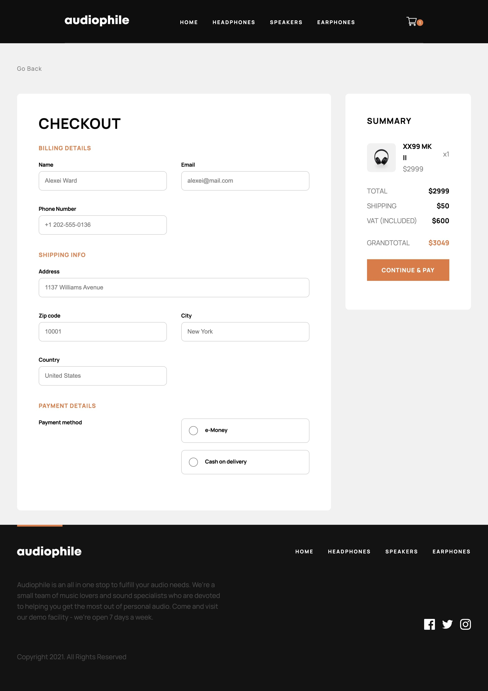

# Audiophile E-commerce

A modern e-commerce web app for browsing and purchasing audio products, built with React and TypeScript, based on the design by Frontend Mentor.

## Features

- Add, remove, and update items in the cart
- Cart persistence with localStorage
- Fully responsive design
- Navigation with React Router
- Type-safe codebase with TypeScript
- Global state management with Context + useReducer
- Checkout form with validation
- Micro-interactions and UI feedback

## Live Demo

[Live Demo](https://aesthetic-halva-3fb25d.netlify.app/)

## Project Screenshots

  



## Tech Stack

- React
- TypeScript
- React Router
- Context API + useReducer
- CSS (with partial CSS Modules)
- Vite

## Getting Started

Clone the repository:

```bash
git clone https://github.com/confett0/audiophile-ecommerce
cd audiophile-ecommerce
```

Install dependencies:

```bash
npm install
```

Run the development server:

```bash
npm run dev
```

## Build

```bash
npm run build
```

## 📁 Project Structure

```
src/
  components/
  context/
  pages/
  types/
  hooks/
  styles/
```

## Future Improvements

- Search functionality
- Full accessibility improvements (focus trap, keyboard navigation)
- Unit and integration tests

## About

This project was originally built and later refactored with TypeScript to improve code quality, maintainability, and scalability.

---

## 📄 License

This project is for portfolio purposes.
